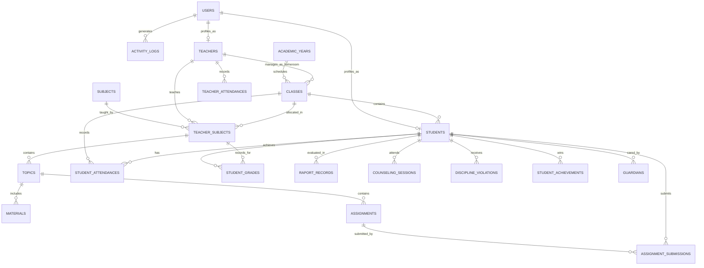

# SPESIFIKASI SKEMA BASIS DATA (DATABASE SCHEMA & DATA DICTIONARY)
## Smart School LMS — UPT SDN 9 Gandangbatu Sillanan
**Penyedia Solusi:** TechSoe (Teknologi Inovasi Soedirman)  
**Database Engine:** MySQL 8.0 Community Server  
**Backend Framework:** Laravel 13  
**Versi Dokumen:** 1.1.0  
**Tanggal:** 25 September 2026  

---

## 1. Diagram Relasi Entitas (Entity Relationship Diagram - ERD)

---

## 2. Struktur Tabel & Kamus Data (MySQL 8.0)

### 2.1 Modul 01: Autentikasi & Multi-Level Pengguna

#### Tabel: `users`
Menyimpan kredensial otentikasi login akun untuk seluruh tingkatan pengguna.
| Kolom | Tipe Data | Nullable | Keterangan |
| :--- | :--- | :--- | :--- |
| `id` | BIGINT UNSIGNED AUTO_INCREMENT | NO | Primary Key |
| `name` | VARCHAR(255) | NO | Nama lengkap pengguna |
| `username` | VARCHAR(100) | NO | Username unik (NIP, NISN, atau username admin) |
| `email` | VARCHAR(255) | YES | Alamat email unik pengguna |
| `password` | VARCHAR(255) | NO | Hash bcrypt kata sandi |
| `role` | ENUM('admin','guru','siswa','wali_kelas','bk','pimpinan') | NO | Tingkatan hak akses peran |
| `phone_number` | VARCHAR(20) | YES | Nomor telepon / WhatsApp aktif |
| `avatar` | VARCHAR(255) | YES | Path lokasi foto profil pengguna |
| `is_active` | BOOLEAN | NO | Status aktif akun (Default: 1 / Aktif) |
| `last_login_at` | TIMESTAMP | YES | Rekam waktu terakhir kali login |
| `remember_token` | VARCHAR(100) | YES | Token sesi remember-me |
| `created_at` | TIMESTAMP | YES | Waktu pembuatan data |
| `updated_at` | TIMESTAMP | YES | Waktu perubahan data |

* **Index:** `UNIQUE KEY idx_users_username (username)`, `UNIQUE KEY idx_users_email (email)`, `INDEX idx_users_role (role)`.

#### Tabel: `activity_logs`
Mencatat seluruh rekam jejak audit tindakan penting dalam sistem.
| Kolom | Tipe Data | Nullable | Keterangan |
| :--- | :--- | :--- | :--- |
| `id` | BIGINT UNSIGNED AUTO_INCREMENT | NO | Primary Key |
| `user_id` | BIGINT UNSIGNED | YES | Foreign Key ke `users.id` (CASCADE on delete: Set Null) |
| `action` | VARCHAR(100) | NO | Nama aksi (contoh: LOGIN, UPDATE_NILAI, EXPORT_REKAP) |
| `description` | TEXT | NO | Narasi deskripsi tindakan yang dilakukan |
| `ip_address` | VARCHAR(45) | YES | Alamat IP pengguna |
| `user_agent` | TEXT | YES | Informasi peramban dan sistem operasi |
| `created_at` | TIMESTAMP | NO | Waktu aksi dicatat |

---

### 2.2 Modul 02 & 03: Kelembagaan, Master Data & Akademik

#### Tabel: `school_profiles`
Menyimpan identitas satuan pendidikan UPT SDN 9 Gandangbatu Sillanan.
| Kolom | Tipe Data | Nullable | Keterangan |
| :--- | :--- | :--- | :--- |
| `id` | INT UNSIGNED AUTO_INCREMENT | NO | Primary Key |
| `npsn` | VARCHAR(20) | NO | Nomor Pokok Sekolah Nasional |
| `school_name` | VARCHAR(255) | NO | Nama resmi sekolah (UPT SDN 9 Gandangbatu Sillanan) |
| `principal_name`| VARCHAR(255) | NO | Nama Kepala Sekolah (Hendrika Genti, S.Pd.SD.) |
| `principal_nip` | VARCHAR(30) | YES | NIP Kepala Sekolah (198502012010012025) |
| `address` | TEXT | NO | Alamat lengkap sekolah |
| `village` | VARCHAR(100) | YES | Desa / Kelurahan |
| `district` | VARCHAR(100) | YES | Kecamatan (Gandangbatu Sillanan) |
| `regency` | VARCHAR(100) | YES | Kabupaten / Kota (Tana Toraja) |
| `province` | VARCHAR(100) | YES | Provinsi (Sulawesi Selatan) |
| `postal_code` | VARCHAR(10) | YES | Kode Pos |
| `phone` | VARCHAR(25) | YES | Nomor telepon kantor |
| `email` | VARCHAR(100) | YES | Alamat email resmi sekolah |
| `logo_path` | VARCHAR(255) | YES | Path file logo sekolah |
| `website` | VARCHAR(100) | YES | Alamat website resmi |
| `created_at` | TIMESTAMP | YES | Timestamps |
| `updated_at` | TIMESTAMP | YES | Timestamps |

#### Tabel: `academic_years`
Data konfigurasi tahun ajaran dan semester aktif.
| Kolom | Tipe Data | Nullable | Keterangan |
| :--- | :--- | :--- | :--- |
| `id` | BIGINT UNSIGNED AUTO_INCREMENT | NO | Primary Key |
| `name` | VARCHAR(50) | NO | Format: 2026/2027 |
| `semester` | ENUM('ganjil', 'genap') | NO | Semester aktif |
| `is_active` | BOOLEAN | NO | Flag tahun ajaran aktif (Hanya satu bernilai 1) |
| `start_date` | DATE | NO | Tanggal mulai semester |
| `end_date` | DATE | NO | Tanggal selesai semester |
| `created_at` | TIMESTAMP | YES | Timestamps |
| `updated_at` | TIMESTAMP | YES | Timestamps |

#### Tabel: `teachers`
Data induk tenaga pendidik dan kependidikan.
| Kolom | Tipe Data | Nullable | Keterangan |
| :--- | :--- | :--- | :--- |
| `id` | BIGINT UNSIGNED AUTO_INCREMENT | NO | Primary Key |
| `user_id` | BIGINT UNSIGNED | NO | Foreign Key ke `users.id` (UNIQUE) |
| `nip` | VARCHAR(30) | YES | Nomor Induk Pegawai (UNIQUE) |
| `nuptk` | VARCHAR(30) | YES | NUPTK Guru |
| `full_name` | VARCHAR(255) | NO | Nama lengkap beserta gelar akademik |
| `gender` | ENUM('L', 'P') | NO | Jenis kelamin (L = Laki-laki, P = Perempuan) |
| `employment_status`| ENUM('PNS', 'PPPK', 'GTT', 'Honorer') | NO | Status kepegawaian |
| `education_level`| VARCHAR(50) | YES | Tingkat pendidikan terakhir |
| `created_at` | TIMESTAMP | YES | Timestamps |
| `updated_at` | TIMESTAMP | YES | Timestamps |

#### Tabel: `classes`
Data rombongan belajar (Tingkat Kelas 1 sampai Kelas 6).
| Kolom | Tipe Data | Nullable | Keterangan |
| :--- | :--- | :--- | :--- |
| `id` | BIGINT UNSIGNED AUTO_INCREMENT | NO | Primary Key |
| `academic_year_id`| BIGINT UNSIGNED | NO | FK ke `academic_years.id` |
| `grade_level` | TINYINT UNSIGNED | NO | Tingkat kelas (1, 2, 3, 4, 5, 6) |
| `name` | VARCHAR(50) | NO | Nama rombel (contoh: Kelas 1, Kelas 6) |
| `homeroom_teacher_id`| BIGINT UNSIGNED | YES | FK ke `teachers.id` (Wali Kelas) |
| `created_at` | TIMESTAMP | YES | Timestamps |
| `updated_at` | TIMESTAMP | YES | Timestamps |

#### Tabel: `subjects`
Katalog mata pelajaran dan Kriteria Ketuntasan Minimal (KKM).
| Kolom | Tipe Data | Nullable | Keterangan |
| :--- | :--- | :--- | :--- |
| `id` | BIGINT UNSIGNED AUTO_INCREMENT | NO | Primary Key |
| `code` | VARCHAR(20) | NO | Kode mapel unik (contoh: MAT-SD, BIN-SD) |
| `name` | VARCHAR(150) | NO | Nama mata pelajaran |
| `category` | ENUM('wajib', 'muatan_lokal', 'pilihan') | NO | Kategori mapel |
| `kkm` | DECIMAL(5,2) | NO | KKM Standar (Default: 75.00) |
| `created_at` | TIMESTAMP | YES | Timestamps |
| `updated_at` | TIMESTAMP | YES | Timestamps |

#### Tabel: `teacher_subjects`
Pemetaan distribusi mengajar guru di tiap rombel.
| Kolom | Tipe Data | Nullable | Keterangan |
| :--- | :--- | :--- | :--- |
| `id` | BIGINT UNSIGNED AUTO_INCREMENT | NO | Primary Key |
| `teacher_id` | BIGINT UNSIGNED | NO | FK ke `teachers.id` |
| `subject_id` | BIGINT UNSIGNED | NO | FK ke `subjects.id` |
| `class_id` | BIGINT UNSIGNED | NO | FK ke `classes.id` |
| `academic_year_id`| BIGINT UNSIGNED | NO | FK ke `academic_years.id` |
| `created_at` | TIMESTAMP | YES | Timestamps |
| `updated_at` | TIMESTAMP | YES | Timestamps |

---

### 2.3 Modul 04: Buku Induk Siswa

#### Tabel: `students`
Data profil induk siswa SDN 9 Gandangbatu Sillanan.
| Kolom | Tipe Data | Nullable | Keterangan |
| :--- | :--- | :--- | :--- |
| `id` | BIGINT UNSIGNED AUTO_INCREMENT | NO | Primary Key |
| `user_id` | BIGINT UNSIGNED | NO | FK ke `users.id` (UNIQUE) |
| `nis` | VARCHAR(20) | NO | Nomor Induk Siswa Sekolah (UNIQUE) |
| `nisn` | VARCHAR(10) | NO | NISN Nasional (UNIQUE) |
| `nik` | VARCHAR(20) | YES | Nomor Induk Kependudukan |
| `full_name` | VARCHAR(255) | NO | Nama lengkap siswa |
| `class_id` | BIGINT UNSIGNED | NO | FK ke `classes.id` |
| `gender` | ENUM('L', 'P') | NO | Jenis Kelamin |
| `birth_place` | VARCHAR(100) | NO | Tempat Lahir |
| `birth_date` | DATE | NO | Tanggal Lahir |
| `religion` | VARCHAR(50) | NO | Agama |
| `address` | TEXT | YES | Alamat domisili tempat tinggal |
| `entry_date` | DATE | NO | Tanggal mulai terdaftar di sekolah |
| `status` | ENUM('aktif', 'lulus', 'mutasi', 'keluar')| NO | Status kesiswaan (Default: aktif) |
| `created_at` | TIMESTAMP | YES | Timestamps |
| `updated_at` | TIMESTAMP | YES | Timestamps |

#### Tabel: `guardians`
Data orang tua atau wali murid siswa.
| Kolom | Tipe Data | Nullable | Keterangan |
| :--- | :--- | :--- | :--- |
| `id` | BIGINT UNSIGNED AUTO_INCREMENT | NO | Primary Key |
| `student_id` | BIGINT UNSIGNED | NO | FK ke `students.id` (ON DELETE CASCADE) |
| `relation_type` | ENUM('ayah', 'ibu', 'wali') | NO | Status hubungan keluarga |
| `name` | VARCHAR(255) | NO | Nama lengkap orang tua / wali |
| `occupation` | VARCHAR(100) | YES | Pekerjaan orang tua |
| `phone_number` | VARCHAR(25) | YES | Kontak darurat orang tua / WhatsApp |
| `address` | TEXT | YES | Alamat tempat tinggal |
| `created_at` | TIMESTAMP | YES | Timestamps |
| `updated_at` | TIMESTAMP | YES | Timestamps |

---

### 2.4 Modul 05, 06, 07: LMS Pembelajaran, Presensi & Penilaian

#### Tabel: `topics`
Pengelompokan materi dan bab pembelajaran per mapel kelas.
| Kolom | Tipe Data | Nullable | Keterangan |
| :--- | :--- | :--- | :--- |
| `id` | BIGINT UNSIGNED AUTO_INCREMENT | NO | Primary Key |
| `teacher_subject_id`| BIGINT UNSIGNED | NO | FK ke `teacher_subjects.id` |
| `title` | VARCHAR(255) | NO | Judul bab / kompetensi dasar |
| `description` | TEXT | YES | Deskripsi capaian pembelajaran |
| `order` | INT | NO | Urutan tampilan bab |
| `created_at` | TIMESTAMP | YES | Timestamps |
| `updated_at` | TIMESTAMP | YES | Timestamps |

#### Tabel: `materials`
Berkas modul bahan ajar yang diunggah oleh guru.
| Kolom | Tipe Data | Nullable | Keterangan |
| :--- | :--- | :--- | :--- |
| `id` | BIGINT UNSIGNED AUTO_INCREMENT | NO | Primary Key |
| `topic_id` | BIGINT UNSIGNED | NO | FK ke `topics.id` |
| `title` | VARCHAR(255) | NO | Judul materi |
| `type` | ENUM('file', 'video_link', 'article') | NO | Jenis materi |
| `file_path` | VARCHAR(255) | YES | Path file dokumen (PDF, PPT, DOCX) |
| `content_url` | TEXT | YES | Tautan video edukasi |
| `body_text` | LONGTEXT | YES | Teks artikel pembelajaran |
| `created_at` | TIMESTAMP | YES | Timestamps |
| `updated_at` | TIMESTAMP | YES | Timestamps |

#### Tabel: `assignments`
Daftar penugasan dan asesmen dari guru mapel.
| Kolom | Tipe Data | Nullable | Keterangan |
| :--- | :--- | :--- | :--- |
| `id` | BIGINT UNSIGNED AUTO_INCREMENT | NO | Primary Key |
| `topic_id` | BIGINT UNSIGNED | NO | FK ke `topics.id` |
| `title` | VARCHAR(255) | NO | Judul penugasan |
| `instructions` | TEXT | NO | Petunjuk pengerjaan tugas |
| `attachment_path`| VARCHAR(255) | YES | Lampiran lembar soal dari guru |
| `due_date` | DATETIME | NO | Batas akhir pengumpulan tugas |
| `max_score` | INT | NO | Nilai maksimum (Default: 100) |
| `created_at` | TIMESTAMP | YES | Timestamps |
| `updated_at` | TIMESTAMP | YES | Timestamps |

#### Tabel: `assignment_submissions`
Berkas pengumpulan tugas dan hasil penilaian siswa.
| Kolom | Tipe Data | Nullable | Keterangan |
| :--- | :--- | :--- | :--- |
| `id` | BIGINT UNSIGNED AUTO_INCREMENT | NO | Primary Key |
| `assignment_id` | BIGINT UNSIGNED | NO | FK ke `assignments.id` |
| `student_id` | BIGINT UNSIGNED | NO | FK ke `students.id` |
| `submitted_at` | DATETIME | NO | Waktu siswa mengirim tugas |
| `file_path` | VARCHAR(255) | YES | Path file jawaban / foto lembar kerja |
| `student_notes` | TEXT | YES | Catatan tambahan siswa |
| `score` | DECIMAL(5,2) | YES | Nilai evaluasi guru (0.00 - 100.00) |
| `teacher_feedback`| TEXT | YES | Umpan balik & catatan evaluasi guru |
| `graded_at` | DATETIME | YES | Waktu penilaian dilakukan |
| `created_at` | TIMESTAMP | YES | Timestamps |
| `updated_at` | TIMESTAMP | YES | Timestamps |

#### Tabel: `student_attendances`
Rekam catatan presensi harian siswa SDN 9 Gandangbatu Sillanan.
| Kolom | Tipe Data | Nullable | Keterangan |
| :--- | :--- | :--- | :--- |
| `id` | BIGINT UNSIGNED AUTO_INCREMENT | NO | Primary Key |
| `student_id` | BIGINT UNSIGNED | NO | FK ke `students.id` |
| `class_id` | BIGINT UNSIGNED | NO | FK ke `classes.id` |
| `academic_year_id`| BIGINT UNSIGNED | NO | FK ke `academic_years.id` |
| `attendance_date`| DATE | NO | Tanggal pencatatan kehadiran |
| `status` | ENUM('Hadir', 'Izin', 'Sakit', 'Alpa') | NO | Status kehadiran |
| `notes` | VARCHAR(255) | YES | Keterangan surat izin/alasan |
| `recorded_by` | BIGINT UNSIGNED | NO | FK ke `users.id` (Pencatat) |
| `created_at` | TIMESTAMP | YES | Timestamps |
| `updated_at` | TIMESTAMP | YES | Timestamps |

* **Index:** `UNIQUE KEY idx_student_daily_att (student_id, attendance_date)`.

#### Tabel: `teacher_attendances`
Rekam presensi harian guru & tenaga pendidik.
| Kolom | Tipe Data | Nullable | Keterangan |
| :--- | :--- | :--- | :--- |
| `id` | BIGINT UNSIGNED AUTO_INCREMENT | NO | Primary Key |
| `teacher_id` | BIGINT UNSIGNED | NO | FK ke `teachers.id` |
| `attendance_date`| DATE | NO | Tanggal presensi |
| `status` | ENUM('Hadir', 'Izin', 'Sakit', 'Dinas_Luar', 'Alpa') | NO | Status kehadiran |
| `check_in_time` | TIME | YES | Waktu masuk sekolah |
| `notes` | VARCHAR(255) | YES | Keterangan tambahan |
| `created_at` | TIMESTAMP | YES | Timestamps |
| `updated_at` | TIMESTAMP | YES | Timestamps |

---

### 2.5 Modul 08: E-Raport & Pengolahan Nilai

#### Tabel: `student_grades`
Daftar nilai komponen capaian belajar per mapel untuk buku rapor.
| Kolom | Tipe Data | Nullable | Keterangan |
| :--- | :--- | :--- | :--- |
| `id` | BIGINT UNSIGNED AUTO_INCREMENT | NO | Primary Key |
| `student_id` | BIGINT UNSIGNED | NO | FK ke `students.id` |
| `teacher_subject_id`| BIGINT UNSIGNED | NO | FK ke `teacher_subjects.id` |
| `academic_year_id`| BIGINT UNSIGNED | NO | FK ke `academic_years.id` |
| `tugas_avg` | DECIMAL(5,2) | NO | Rata-rata nilai tugas/harian (Bobot: 30%) |
| `uts_score` | DECIMAL(5,2) | NO | Nilai Asesmen Tengah Semester (Bobot: 30%) |
| `uas_score` | DECIMAL(5,2) | NO | Nilai Asesmen Akhir Semester (Bobot: 40%) |
| `final_score` | DECIMAL(5,2) | NO | Nilai Akhir Terkalkulasi (0.00 - 100.00) |
| `letter_grade` | ENUM('A', 'B', 'C', 'D') | NO | Predikat Capaian |
| `competency_desc`| TEXT | YES | Deskripsi capaian kompetensi otomatis |
| `created_at` | TIMESTAMP | YES | Timestamps |
| `updated_at` | TIMESTAMP | YES | Timestamps |

#### Tabel: `raport_evaluations`
Data rekap status pengesahan E-Raport oleh Wali Kelas & Kepala Sekolah.
| Kolom | Tipe Data | Nullable | Keterangan |
| :--- | :--- | :--- | :--- |
| `id` | BIGINT UNSIGNED AUTO_INCREMENT | NO | Primary Key |
| `student_id` | BIGINT UNSIGNED | NO | FK ke `students.id` |
| `academic_year_id`| BIGINT UNSIGNED | NO | FK ke `academic_years.id` |
| `class_id` | BIGINT UNSIGNED | NO | FK ke `classes.id` |
| `attitude_score` | ENUM('Sangat Baik', 'Baik', 'Cukup', 'Kurang') | NO | Nilai Sikap & Kepribadian |
| `homeroom_notes` | TEXT | YES | Catatan wali kelas untuk lembar rapor |
| `status` | ENUM('draft', 'verified_wali_kelas', 'approved_kepsek', 'published') | NO | Tahapan verifikasi rapor |
| `verified_at` | TIMESTAMP | YES | Waktu verifikasi oleh Wali Kelas |
| `approved_at` | TIMESTAMP | YES | Waktu pengesahan oleh Kepala Sekolah |
| `created_at` | TIMESTAMP | YES | Timestamps |
| `updated_at` | TIMESTAMP | YES | Timestamps |

---

### 2.6 Modul 09: Bimbingan Konseling (BK)

#### Tabel: `counseling_sessions`
Dokumentasi bimbingan konseling perilaku siswa.
| Kolom | Tipe Data | Nullable | Keterangan |
| :--- | :--- | :--- | :--- |
| `id` | BIGINT UNSIGNED AUTO_INCREMENT | NO | Primary Key |
| `student_id` | BIGINT UNSIGNED | NO | FK ke `students.id` |
| `counselor_id` | BIGINT UNSIGNED | NO | FK ke `teachers.id` (Guru BK) |
| `session_date` | DATE | NO | Tanggal sesi konseling |
| `topic` | VARCHAR(255) | NO | Permasalahan / Topik pembinaan |
| `action_plan` | TEXT | NO | Rencana tindak lanjut dan solusi |
| `is_confidential`| BOOLEAN | NO | Tanda kerahasiaan catatan (Default: 1) |
| `created_at` | TIMESTAMP | YES | Timestamps |
| `updated_at` | TIMESTAMP | YES | Timestamps |

#### Tabel: `discipline_violations`
Rekam inventarisasi pelanggaran kedisiplinan dan poin sanksi.
| Kolom | Tipe Data | Nullable | Keterangan |
| :--- | :--- | :--- | :--- |
| `id` | BIGINT UNSIGNED AUTO_INCREMENT | NO | Primary Key |
| `student_id` | BIGINT UNSIGNED | NO | FK ke `students.id` |
| `violation_date`| DATE | NO | Tanggal kejadian pelanggaran |
| `violation_name`| VARCHAR(255) | NO | Nama pelanggaran kedisiplinan |
| `penalty_points`| INT UNSIGNED | NO | Jumlah poin sanksi |
| `sanction_action`| TEXT | YES | Tindakan pembinaan yang diberikan |
| `call_letter_sent`| BOOLEAN | NO | Tanda penerbitan surat panggilan wali (1/0)|
| `created_at` | TIMESTAMP | YES | Timestamps |
| `updated_at` | TIMESTAMP | YES | Timestamps |

#### Tabel: `student_achievements`
Pencatatan prestasi lomba dan capaian siswa di luar kelas.
| Kolom | Tipe Data | Nullable | Keterangan |
| :--- | :--- | :--- | :--- |
| `id` | BIGINT UNSIGNED AUTO_INCREMENT | NO | Primary Key |
| `student_id` | BIGINT UNSIGNED | NO | FK ke `students.id` |
| `title` | VARCHAR(255) | NO | Nama kejuaraan / prestasi |
| `level` | ENUM('sekolah', 'kecamatan', 'kabupaten', 'provinsi', 'nasional') | NO | Tingkat kejuaraan |
| `rank` | VARCHAR(50) | NO | Juara yang diraih |
| `event_date` | DATE | NO | Tanggal perolehan prestasi |
| `certificate_file`| VARCHAR(255) | YES | Path scan piagam penghargaan |
| `created_at` | TIMESTAMP | YES | Timestamps |
| `updated_at` | TIMESTAMP | YES | Timestamps |

---

### 2.7 Modul 12: Pengumuman & Notifikasi

#### Tabel: `announcements`
Buletin informasi dan maklumat sekolah.
| Kolom | Tipe Data | Nullable | Keterangan |
| :--- | :--- | :--- | :--- |
| `id` | BIGINT UNSIGNED AUTO_INCREMENT | NO | Primary Key |
| `title` | VARCHAR(255) | NO | Judul pengumuman |
| `content` | TEXT | NO | Isi pesan pengumuman |
| `target_role` | ENUM('all', 'guru', 'siswa', 'wali_kelas') | NO | Segregasi penerima maklumat |
| `is_popup` | BOOLEAN | NO | Tampilkan popup modal sesaat setelah login |
| `published_at` | TIMESTAMP | NO | Waktu rilis pengumuman |
| `created_by` | BIGINT UNSIGNED | NO | FK ke `users.id` |
| `created_at` | TIMESTAMP | YES | Timestamps |
| `updated_at` | TIMESTAMP | YES | Timestamps |
