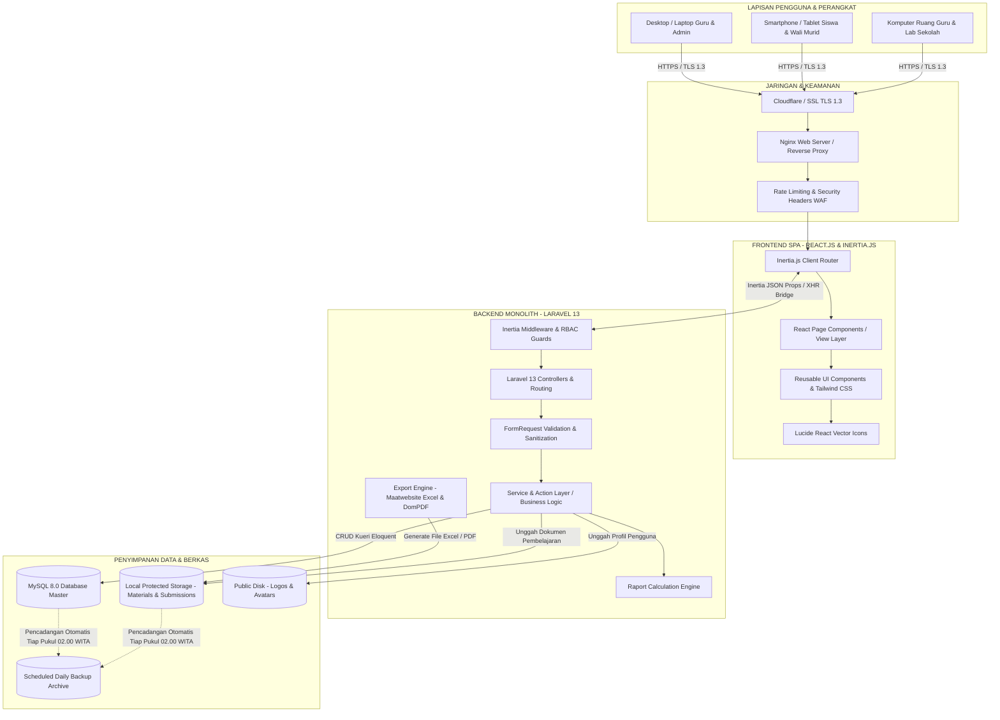

# ARSITEKTUR SISTEM & SPESIFIKASI TEKNIS (SYSTEM ARCHITECTURE)
## Smart School LMS — UPT SDN 9 Gandangbatu Sillanan
**Penyedia Solusi:** TechSoe (Teknologi Inovasi Soedirman)  
**Tech Stack:** Laravel 13, React.js, Inertia.js, MySQL 8.0, Tailwind CSS  
**Versi Dokumen:** 1.1.0  
**Tanggal:** 25 September 2026  

---

## 1. Diagram Arsitektur Tingkat Tinggi (High-Level Architecture)



---

## 2. Matriks Kontrol Hak Akses (Role-Based Access Control - RBAC)

Sistem mengimplementasikan 6 tingkatan peran dengan kontrol akses ketat:

| Modul & Fitur | Admin | Guru Mapel | Siswa | Wali Kelas | Guru BK | Pimpinan / Kepsek |
| :--- | :---: | :---: | :---: | :---: | :---: | :---: |
| **01. Manajemen User & Akun** | CRUD | Self Profil | Self Profil | Self Profil | Self Profil | Read Only |
| **02. Kelembagaan & Tahun Ajaran** | CRUD | Read | Read | Read | Read | Read |
| **03. Master Data (Guru, Rombel, Mapel)**| CRUD | Read | Read | Read | Read | Read |
| **04. Buku Induk Siswa** | CRUD | Read | Self Read | Class CRUD | Read | Read & Export |
| **05. LMS (Materi & Forum Diskusi)** | Manage | CRUD Own | Read & Reply | Read | - | Monitoring |
| **06. Presensi Siswa & Guru** | Full CRUD | Input Mapel | Self View | Rekap Rombel | Read Alert | Monitoring & Rekap |
| **07. Tugas, Asesmen & Penilaian** | Manage | CRUD Own | Submit Tugas | Monitoring | - | Monitoring |
| **08. E-Raport (Pengolahan & Verifikasi)**| Manage | Input Leger | Lihat Rapor | Verifikasi | - | Pengesahan / Approve |
| **09. Bimbingan Konseling (BK)** | Audit | Rujukan BK | - | Rujukan BK | Full CRUD | Monitoring BK |
| **10. Ekspor Excel & Laporan PDF** | Full | Nilai & Absen | Cetak Rapor | Leger Rombel | Laporan BK | Full Eksekutif |
| **11. Dashboard Eksekutif & Statistik** | System KPI | Teacher KPI | Student KPI | Class KPI | BK KPI | Executive KPI |
| **12. Pengumuman & Notifikasi** | Broadcast | Class Info | Read | Class Info | BK Info | Broadcast Maklumat |

---

## 3. Siklus Hidup Permintaan Inertia.js (Request-Response Lifecycle)

```
[ BROWSER - REACT COMPONENT ]
       │
       ▼ (1) Pengguna klik Link Inertia / submit form (useForm)
[ INERTIA.JS CLIENT ENGINE ] (Mengirim XHR Request dengan header X-Inertia: true)
       │
       ▼ (2) Forward via Nginx Web Server
[ LARAVEL 13 HTTP PIPELINE ]
       │
       ├──> [ Global Middleware: HandleInertiaRequests ]
       ├──> [ Session & CSRF Token Verification ]
       ├──> [ Authentication Guard (Auth::check) ]
       └──> [ Role Middleware (RoleMiddleware) ]
       │
       ▼ (3) FormRequest Validation (Sanitasi data masukan)
[ FORM REQUEST VALIDATION ]
       │
       ▼ (4) Eksekusi Controller & Service Layer
[ CONTROLLER -> SERVICE LAYER ]
       │
       ▼ (5) Kueri Transaksional MySQL 8.0
[ DATABASE (MySQL 8.0) ] <──> Integritas Foreign Keys & Index
       │
       ▼ (6) Return Inertia::render('PageName', $props)
[ INERTIA RESPONSE BUILDER ] (Serialisasi data ke JSON Props)
       │
       ▼ (7) Kirim kembali ke Klien
[ BROWSER - REACT ENGINE ] (Re-render komponen spesifik tanpa reload halaman penuh)
```

---

## 4. Alur Mesin Kalkulasi E-Raport (Raport Calculation Engine)

Formula perhitungan nilai akhir mata pelajaran pada semester aktif berpedoman pada kaidah kurikulum pendidikan dasar:

$$\text{Nilai Akhir (NA)} = (\text{Rata-rata Tugas} \times 0.30) + (\text{UTS} \times 0.30) + (\text{UAS} \times 0.40)$$

### 4.1 Tabel Konversi Predikat Akademik
| Rentang Nilai Akhir | Predikat | Kualifikasi Capaian Kompetensi |
| :---: | :---: | :--- |
| **89.00 - 100.00** | **A** | Sangat Baik — Menunjukkan penguasaan kompetensi yang sangat optimal dan melampaui kriteria ketuntasan. |
| **78.00 - 88.99** | **B** | Baik — Menunjukkan penguasaan kompetensi yang baik dan telah memenuhi kriteria ketuntasan. |
| **65.00 - 77.99** | **C** | Cukup — Menunjukkan penguasaan kompetensi yang cukup namun memerlukan penguatan pada materi tertentu. |
| **< 65.00** | **D** | Perlu Bimbingan — Belum mencapai ketuntasan minimal, memerlukan intervensi remedial intensif. |

---

## 5. Mesin Ekspor Dokumen (Export & Reporting Engine)

1. **Ekspor Spreadsheet (.xlsx):**
   * Pustaka: `maatwebsite/excel`.
   * Template lembar kerja disematkan kop surat resmi UPT SDN 9 Gandangbatu Sillanan, garis kisi rapi (*thin border*), dan format angka presisi.
   * Modul: Rekap Presensi Bulanan, Data Induk Siswa, Leger Nilai Rapor Per Kelas.
2. **Pencetakan Berkas PDF Siap Cetak (.pdf):**
   * Pustaka: `barryvdh/laravel-dompdf`.
   * Halaman Portrait A4 untuk Lembar E-Raport Siswa & Lembar Buku Induk.
   * Halaman Landscape A4 untuk Rekapitulasi Presensi Semesteran & Leger Kurikulum.
   * Dilengkapi penanda tanda tangan resmi Kepala Sekolah (**Hendrika Genti, S.Pd.SD.**) dan Wali Kelas.

---

## 6. Strategi Manajemen Penyimpanan Berkas (File Storage Architecture)

* **Direktori Modul Bahan Ajar (`storage/app/materials/`):** Menyimpan file materi ajar (.pdf, .pptx, .docx). Hak akses diverifikasi berdasarkan rombel siswa.
* **Direktori Jawaban Tugas (`storage/app/submissions/`):** Menyimpan berkas pengumpulan jawaban siswa.
* **Direktori Foto Profil & Logo (`storage/app/public/avatars/` & `/logos/`):** Diakses melalui symbolic link publik (`php artisan storage:link`).
* **Sanitasi Nama Berkas:** Seluruh file yang diunggah diberi nama hash acak UUID unik untuk mencegah konflik nama dan eksekusi skrip berbahaya.
